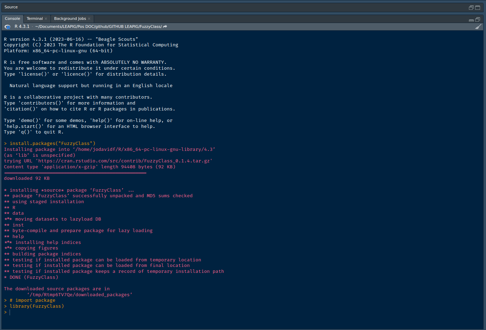

# FuzzyClass 

<!-- badges: start -->

[](https://cran.r-project.org/package=FuzzyClass)
[](https://cran.r-project.org/package=FuzzyClass)
<!-- badges: end -->

Last update: 10-08-2023

## A family of probabilities-based classifiers fuzzy and non-fuzzy

### Dependencies

Below is the list of packages on which `FuzzyClass` depends. However,
during its installation, `FuzzyClass` automatically installs the
dependencies:

- [caTools](https://cran.r-project.org/package=caTools)
- [doParallel](https://cran.r-project.org/package=doParallel)
- [e1071](https://cran.r-project.org/package=e1071)
- [EnvStats](https://cran.r-project.org/package=EnvStats)
- [foreach](https://cran.r-project.org/package=foreach)
- [MASS](https://cran.r-project.org/package=MASS)
- [maxLik](https://cran.r-project.org/package=maxLik)
- [mvtnorm](https://cran.r-project.org/package=mvtnorm)
- [purrr](https://cran.r-project.org/package=purrr)
- [dplyr](https://cran.r-project.org/package=dplyr)
- [Rdpack](https://cran.r-project.org/package=Rdpack)
- [rootSolve](https://cran.r-project.org/package=rootSolve)

### Installation

``` r
# Installation
install.packages("devtools")
devtools::install_github("leapigufpb/FuzzyClass")
```

### Usage

``` r
# package import
library(FuzzyClass)
```



### Data reading and preparation for use

``` r

library(FuzzyClass)

#' ---------------------------------------------
#' The following shows how the functions are used:
#' --------------
#' Reading a database:
#'
#' Actual training data:
data(VirtualRealityData)

VirtualRealityData <- as.data.frame(VirtualRealityData)

# Splitting into Training and Testing
split <- caTools::sample.split(t(VirtualRealityData[,1]), SplitRatio = 0.7)
Train <- subset(VirtualRealityData, split == "TRUE")
Test <- subset(VirtualRealityData, split == "FALSE")
# ----------------

test = Test[,-4]
```

#### Fuzzy Gaussian Naive Bayes with Fuzzy Parameters

``` r
# --------------------------------------------------
# Fuzzy Gaussian Naive Bayes with Fuzzy Parameters


fit_FGNB <- GauNBFuzzyParam(train =  Train[,-4],
                                    cl = Train[,4], metd = 2, cores = 1)


print(fit_FGNB)
#> 
#> Fuzzy Gaussian Naive Bayes Classifier for Discrete Predictors
#> 
#> Variables:
#> [1] "V1" "V2" "V3"
#> Class:
#> [1] "1" "2" "3"
saida <- predict(fit_FGNB, test)
Table <- table(factor(Test[,4]), saida)
Table
#>    saida
#>      1  2  3
#>   1 54  5  1
#>   2  1 37 18
#>   3  0 12 52

#Accuracy:
sum(diag(Table))/sum(Table)
#> [1] 0.7944444

saidaMatrix <- predict(fit_FGNB, test, type = "matrix")
```

``` r
# --------------------------------------------------
# head view

saida |> head()
#> [1] 1 1 1 1 1 1
#> Levels: 1 2 3

saidaMatrix |> head()
#>              1           2            3
#> [1,] 0.9982027 0.001797179 7.842536e-08
#> [2,] 0.5503209 0.366827524 8.285153e-02
#> [3,] 0.9014399 0.097705726 8.543253e-04
#> [4,] 0.9911943 0.008792640 1.304282e-05
#> [5,] 0.9795244 0.010029007 1.044664e-02
#> [6,] 0.9222658 0.077520975 2.132260e-04
```

------------------------------------------------------------------------

## How to Contribute

If you would like to contribute to FuzzyClass, please follow these
steps:

1.  Fork the `FuzzyClass` repository on GitHub.
2.  Create a new branch for your contribution.
3.  Make your changes to the code or documentation.
4.  Test your changes thoroughly.
5.  Add or update documentation for your changes.
6.  Submit a pull request to the main `FuzzyClass` repository.
7.  The `FuzzyClass` maintainers will review your pull request and may
    ask you to make some changes before it is merged. Once your pull
    request is merged, your contribution will be available to all
    `FuzzyClass` users.

#### Here are some additional tips for contributing to FuzzyClass:

- Please use descriptive commit messages that explain what your changes
  do.
- If you are making a large or complex change, please consider creating
  an issue in the `FuzzyClass` repository first to discuss your plans
  with the maintainers.
- Please be patient while your pull request is reviewed. The maintainers
  may be busy with other things, but they will get to your pull request
  as soon as they can.

#### Thank you for your interest in contributing to FuzzyClass!

------------------------------------------------------------------------

## Reporting Issues

If you find a bug in `FuzzyClass`, please report it by creating an issue
on the `FuzzyClass` repository on GitHub at the link:
<https://github.com/leapigufpb/FuzzyClass/issues>. When reporting an
issue, please include the following information:

1.  A clear and concise description of the bug.
2.  The steps to reproduce the bug.
3.  The expected behavior.
4.  The actual behavior.
5.  Any relevant screenshots or code snippets.
6.  If possible, please also include the version of `FuzzyClass` that
    you are using.

The `FuzzyClass` maintainers will review your issue and may ask you for
more information before they can fix the bug. Once the bug is fixed, a
new release of `FuzzyClass` will be made available.

Here are some additional tips for reporting issues to FuzzyClass:

- Please be as specific as possible when describing the bug.
- If you can, try to reproduce the bug on a clean installation of R.
- Include the output of sessionInfo() when reporting a bug. This will
  help the maintainers to diagnose the problem.
- Please be patient while your issue is being reviewed. The maintainers
  may be busy with other things, but they will get to your issue as soon
  as they can.

##### Thank you for your help in making FuzzyClass a better package

I hope this helps! Let me know if you have any other questions.
